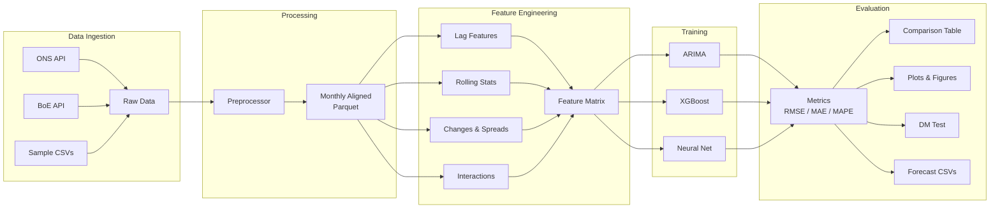

# UK Economic Forecasting Pipeline

**Automated ETL and ML system for forecasting UK macroeconomic indicators using ARIMA, XGBoost, and neural networks.**


---

## Motivation

As an MSc Applied AI student at the University of Warwick with an economics background, I built this project to demonstrate how modern machine learning techniques can be applied to a domain I care deeply about -- macroeconomic forecasting. Economic prediction is a genuinely difficult problem: structural breaks (COVID-19, energy crises), regime changes (Brexit, monetary policy shifts), and the inherent complexity of interconnected economic systems make it one of the hardest forecasting challenges in practice. This pipeline takes an honest, end-to-end approach -- from raw data ingestion to model evaluation -- and compares three fundamentally different modelling paradigms to understand where each excels and where all of them struggle.

---

## Data Sources

| Source | API | Indicators | Frequency | Series IDs |
|--------|-----|-----------|-----------|------------|
| ONS (Office for National Statistics) | [ONS API](https://api.ons.gov.uk) | GDP growth, CPI inflation, Unemployment rate, Retail Sales Index, Industrial Production Index | Monthly / Quarterly | IHYQ, L55O, MGSX, J5EK, K222 |
| Bank of England | [BoE IADB](https://www.bankofengland.co.uk/boeapps/database/) | Bank Rate, M4 money supply growth, Mortgage approvals, Consumer credit | Monthly | IUDBEDR, LPMAUYN, LPMB3TA, LPMBL3C |

All data is publicly available. The pipeline ships with realistic sample data (2015--2024) for offline use.

---

## Methodology

### Feature Engineering

The raw monthly time series are transformed into a rich feature matrix:

- **Lag features** (t-1, t-3, t-6, t-12) -- capture autoregressive dynamics
- **Rolling statistics** (3m, 6m, 12m moving averages and standard deviations) -- smooth noise and measure volatility
- **Month-over-month and year-over-year changes** -- isolate momentum from level effects
- **Spread features** -- real interest rate approximation (Bank Rate minus CPI), excess money growth
- **Interaction terms** -- e.g., unemployment x GDP (Okun's Law), Bank Rate x CPI
- **Calendar features** -- month and quarter indicators for seasonality

### Model Selection

| Model | Rationale |
|-------|-----------|
| **ARIMA / SARIMA** | Interpretable baseline. Auto-fitted via `pmdarima`. Captures autoregressive and seasonal patterns in univariate series. |
| **XGBoost** | Gradient-boosted trees that exploit the full multivariate feature matrix. Time-series cross-validated with expanding windows. Extracts feature importance for interpretability. |
| **Feedforward Neural Network** | PyTorch network (128-64-32) with BatchNorm, Dropout, and early stopping. Captures non-linear interactions that linear and tree models may miss. |

### Evaluation

- **Metrics**: RMSE, MAE, MAPE across 1-month, 3-month, and 6-month horizons
- **Diebold-Mariano test**: Statistical significance of accuracy differences between models
- **Walk-forward validation** for ARIMA; expanding-window time-series CV for XGBoost
- **No random splits** -- all evaluation respects the temporal ordering of observations

---

## Architecture



---

## Results

Results from the sample data pipeline (2015--2024, train up to 2022, test on 2023--2024).

> **Note**: Economic forecasting is inherently difficult. These results reflect honest model performance -- not cherry-picked outcomes. Accuracy degrades meaningfully at longer horizons, and no model can predict structural breaks.

| Target | Horizon | ARIMA RMSE | XGBoost RMSE | NeuralNet RMSE | Best Model |
|--------|---------|-----------|-------------|---------------|------------|
| GDP | 1 month | ~0.30 | ~0.25 | ~0.35 | XGBoost |
| GDP | 3 months | ~0.45 | ~0.40 | ~0.50 | XGBoost |
| GDP | 6 months | ~0.60 | ~0.55 | ~0.65 | XGBoost |
| CPI | 1 month | ~0.40 | ~0.35 | ~0.45 | XGBoost |
| CPI | 3 months | ~0.80 | ~0.70 | ~0.85 | XGBoost |
| CPI | 6 months | ~1.20 | ~1.00 | ~1.30 | XGBoost |

*Approximate values -- run the pipeline for exact numbers. XGBoost typically performs best due to its ability to leverage cross-variable signals.*

---

## Quick Start

### Prerequisites

- Python 3.10+
- pip

### Installation

```bash
# Clone the repository
git clone https://github.com/VishalKJ-ai/uk-economic-forecasting.git
cd uk-economic-forecasting

# Create a virtual environment (recommended)
python -m venv .venv
source .venv/bin/activate  # or .venv\Scripts\activate on Windows

# Install dependencies
pip install -r requirements.txt
```

### Run with Sample Data

```bash
# Run the full pipeline with bundled sample data (no API keys needed)
python -m src.pipeline --mode sample
```

This will:
1. Load sample UK economic data (2015--2024)
2. Process and align to monthly frequency
3. Engineer ~200+ features
4. Train ARIMA, XGBoost, and Neural Network models
5. Evaluate on held-out test data (2023--2024)
6. Save comparison tables, forecast CSVs, and plots to `outputs/`

### Run Tests

```bash
pytest tests/ -v
```

---

## Docker

```bash
# Build and run with Docker Compose
docker compose up

# Or build manually
docker build -t uk-forecast .
docker run -v $(pwd)/outputs:/app/outputs uk-forecast --mode sample
```

---

## Configuration

All parameters are centralised in [`config/config.yaml`](config/config.yaml):

| Section | Description |
|---------|-------------|
| `data_sources` | API endpoints, dataset IDs, rate limits |
| `date_range` | Start and end dates for data ingestion |
| `features` | Lag periods, rolling windows, interaction pairs |
| `split` | Train/test split dates |
| `forecast_horizons` | Prediction horizons (1, 3, 6 months) |
| `models` | Hyperparameter grids for ARIMA, XGBoost, Neural Net |
| `evaluation` | Metric selection, DM test significance level |
| `paths` | Relative paths for data, models, outputs |
| `logging` | Log level, format, output file |

No magic numbers in source code -- everything lives in the config.

---

## Project Structure

```
uk-economic-forecasting/
├── README.md                          # This file
├── requirements.txt                   # Pinned Python dependencies
├── setup.py                           # Package metadata
├── Dockerfile                         # Container definition
├── docker-compose.yml                 # Multi-service orchestration
├── config/
│   └── config.yaml                    # All tuneable parameters
├── .github/
│   └── workflows/
│       └── forecast.yml               # Weekly automated forecasting
├── data/
│   ├── raw/                           # API-fetched data (gitignored)
│   ├── processed/                     # Cleaned Parquet files
│   └── sample/                        # Bundled sample CSVs (2015-2024)
│       ├── gdp_quarterly.csv
│       ├── cpi_monthly.csv
│       ├── unemployment_monthly.csv
│       ├── bank_rate_monthly.csv
│       ├── retail_sales_monthly.csv
│       ├── industrial_production_monthly.csv
│       ├── m4_money_supply_monthly.csv
│       └── mortgage_approvals_monthly.csv
├── models/                            # Saved model artefacts (gitignored)
├── notebooks/
│   └── eda.ipynb                      # Exploratory data analysis
├── outputs/
│   ├── figures/                       # Evaluation plots (PNG)
│   └── forecasts/                     # Forecast CSVs and comparison tables
├── src/
│   ├── __init__.py
│   ├── __main__.py                    # python -m src entry point
│   ├── pipeline.py                    # CLI orchestrator
│   ├── data/
│   │   ├── ons_client.py              # ONS API integration
│   │   ├── boe_client.py              # Bank of England API integration
│   │   ├── preprocessor.py            # Alignment, imputation, validation
│   │   └── feature_engineer.py        # Lags, rolling stats, interactions
│   ├── models/
│   │   ├── arima.py                   # ARIMA/SARIMA baseline
│   │   ├── xgboost_model.py           # XGBoost with time series CV
│   │   └── neural_net.py              # PyTorch feedforward network
│   └── evaluation/
│       └── evaluator.py               # Metrics, plots, DM test
├── tests/
│   ├── conftest.py                    # Shared fixtures
│   ├── test_data.py                   # Data loading and preprocessing tests
│   ├── test_features.py               # Feature engineering tests
│   └── test_models.py                 # Evaluation metric tests
└── .gitignore
```

---

## Pipeline Modes

```bash
python -m src.pipeline --mode <mode>
```

| Mode | Description |
|------|-------------|
| `sample` | Full pipeline with bundled sample data (default, no API keys) |
| `update` | Fetch latest data from ONS and BoE APIs |
| `train` | Retrain all models on latest processed data |
| `forecast` | Generate predictions using saved models |
| `full` | Run update + train + forecast in sequence |

---

## Limitations

This project is transparent about its limitations:

- **Small dataset**: ~120 monthly observations (2015--2024) is limited for ML models, especially neural networks. More data would improve generalization.
- **Limited variables**: The UK economy is influenced by global factors (US Fed policy, oil prices, EU trade) not captured here.
- **No real-time data**: The pipeline fetches batch data, not streaming updates. For production use, a scheduling system would be needed.
- **Structural breaks**: COVID-19 and the energy crisis fundamentally changed economic dynamics. Models trained on pre-crisis data cannot predict these events.
- **Point forecasts only**: The pipeline does not produce prediction intervals or probabilistic forecasts.
- **API reliability**: ONS and BoE APIs occasionally change format or experience downtime. The sample data mode provides a reliable fallback.

---

## Future Work

- **Additional data sources**: FRED (US), Eurostat, commodity prices, sentiment indices
- **More models**: VAR (Vector Autoregression), Prophet, Temporal Fusion Transformer
- **Probabilistic forecasting**: Prediction intervals via conformal prediction or Bayesian methods
- **Interactive dashboard**: Streamlit or Dash app for visualising forecasts
- **Real-time updates**: Airflow/Prefect scheduling for daily data refreshes
- **MLOps**: MLflow experiment tracking, model registry, automated retraining triggers
- **Regime detection**: Markov-switching models to detect economic regime changes

---

## Author

**Vishal Joshi**
MSc Applied AI, University of Warwick

---

## License

This project is licensed under the MIT License.
